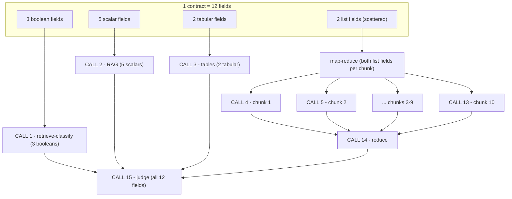
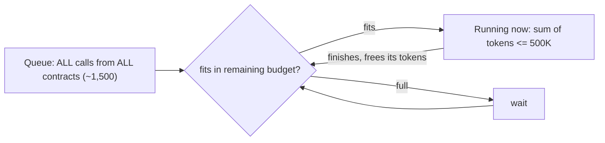

# Plan 01 — Typed extraction quality

**Status:** Proposed · **Date:** 2026-06-22 · **Scope:** gold stage + config (no silver schema change)

## 1. Goal

Replace the single "full text, all 14 fields at once" extraction call with a
**type-driven routing** strategy: each field is extracted with the approach that
suits its *shape*, fields that share a strategy are batched into one call, and
each field's value is validated against its declared `type`. This lifts recall
and precision (especially for tabular, list, and whole-document fields) and
produces a cheap, model-free validation signal that feeds the trust model.

Non-goal: this plan does **not** address whether the underlying DI text is
correct — that is Plan 02. The only shared seam is `derive_trust` and the new
per-type validation signal (see §8).

## 2. Current state (baseline)

- `gold/fields.py` → `_extract_one` issues **one** chat completion with
  `_build_prompt` (all fields, full `extracted_text` up to `max_input_chars` =
  3,000,000) and a freeform `response_format={"type":"json_object"}`.
- `_coerce` mops up type mismatches *after* the fact (e.g. `struct_list` → JSON
  string, integer parse, list split).
- Retrieval substrate already exists but is **unused by gold**:
  - `contract_chunks` (silver, SCD2) — embedded into Azure AI Search index
    `ictr_dev_di_vision` (`serving/search_index.py`).
  - `contract_blocks` (silver) — ordered blocks with `section`, `page`, `type`
    (`prose`/`table`/`figure`).
  - `contract_tables` (silver) — structured `cells` + `markdown` per DI table.

## 3. Field → strategy taxonomy

`type` is the default routing key; a per-field `extraction_strategy` (and
optional `source`) override handles the exceptions where type mispredicts.

| Archetype | Default for type | Fields | Strategy |
|---|---|---|---|
| Boolean presence/property | `boolean` | `auto_renewal`, `data_residency_uk`, `confidentiality_clause` | **retrieve-classify**: retrieve top-k chunks for the question, ask true/false/null + quote. Recall-first. |
| Single-point scalar | `string`,`integer` | `effective_date`, `term_length`, `notice_period`, `governing_law`, `payment_terms` | **RAG-per-field** over merged retrieved chunks; deterministic validation. |
| Tabular scalar/struct | override `source:"tables"` | `contract_value`, `service_level_agreements` | **tables-first**: feed `contract_tables` (cells/markdown) for the relevant section; fall back to RAG. |
| Enumeration / list | `list` | `parties`, `services_offered` | **map-reduce / wide-retrieve**: parties = preamble + signature blocks; services = scope/schedule sections. |
| Whole-document reasoning | override `strategy:"full_text"` | `notable_clauses` | **full-text** (RAG defeats "notable relative to the whole doc"). |

Resolution rule: `extraction_strategy` (explicit) > `source` (explicit) > type
default. Every field resolves to exactly one strategy.

### 3.1 What the model receives per strategy (bundling)

Fields in the **same strategy group share one call**. Strategies never combine
into a single call — each is its own call with its own context.

| Strategy | What the model receives | Calls/contract |
|---|---|---|
| retrieve-classify | top-k *relevant* chunks (never full text) | 1 (all booleans bundled) |
| RAG | top-k *relevant* chunks | 1 (all scalars bundled) |
| tables-first | structured `contract_tables` cells (not prose) | 1 (both tabular bundled) |
| full-text | the **whole contract** in one call | 1 |
| map-reduce | **each chunk in its own call**, then a merge | N_chunks + reduce |

### 3.2 Map-reduce: when, and how many calls

**When:** use map-reduce only when **both** hold — (1) the answer can be
*scattered anywhere* (need full coverage, so a few retrieved chunks risk missing
some), and (2) each part is *independent* (a chunk contributes its piece without
seeing the others). Contrast full-text, which is for full coverage **plus**
cross-part reasoning in one context (`notable_clauses` — "notable relative to
the rest"). `parties`/`services_offered` are scattered-but-independent →
map-reduce.

**Calls:** all the group's fields ride along in each chunk call, so

```
map-reduce calls per contract = N_chunks (map)  +  R (reduce)
```

independent of how many fields are in the group. E.g. 2 list fields over 10
chunks = 10 map calls (each asking for *both* fields) + 1 reduce = 11 calls. The
**reduce can be deterministic** (union/dedupe → 0 LLM calls, e.g.
`services_offered`) or an LLM call when normalization matters (e.g. merging
"Acme Ltd"/"Acme Limited" for `parties`).

## 4. Design

### 4.1 Strategy resolver
New `gold/strategy.py`:
- `resolve_strategy(field)` → one of `RETRIEVE_CLASSIFY`, `RAG`, `TABLES`,
  `MAP_REDUCE`, `FULL_TEXT` from `type` + overrides.
- `group_fields(fields)` → `dict[strategy, list[field]]` so each strategy is
  one batched call (≈3–5 calls/contract instead of 1, vs 14 if per-field).

### 4.2 Retrieval
- Reuse the **existing AI Search index** for retrieval; query per field
  question, take top-k chunks, keep `(chunk_id, page, section)` for evidence
  linkage. New `gold/retrieval.py` thin client over `ai_search` config.
- **Query vectorization: use the index's integrated vectorizer** (server-side).
  Gold sends the field question as plain text; AI Search embeds it with the same
  `text-embedding-3-large` deployment that built the index, so query and
  document vectors always match (a model/version mismatch silently degrades
  retrieval). No client-side embedding call in gold.
- **Full-text fallback**: if retrieval returns < N chunks or low scores, fall
  back to the current full-text path for that strategy group (no recall
  regression vs today).
- `TABLES` strategy reads `contract_tables` directly (no embedding needed).

### 4.3 Per-type structured output
- Per strategy group, build a JSON-schema `response_format` from the field
  `type`s (boolean enum, integer, the `item_fields` for `struct_list`) instead
  of freeform `json_object`. Removes a class of `_coerce` failures.

### 4.4 Per-type validation (the shared seam)
New `gold/validate.py`:
- `validate_value(value, field)` → `valid | invalid | not_applicable` using
  deterministic rules per type: ISO date parses + plausible range
  (`effective_date`); integer parses + bounds (`payment_terms`); currency parses
  (`contract_value`); list dedup/non-empty expectation; `struct_list` items
  carry required keys.
- Output is a new signal consumed by `derive_trust` (see §8): a field that fails
  its type validation is forced to at least `review`.

### 4.5 Orchestration in `fields.py`
- `_process_one` becomes: resolve+group → per-group retrieve+extract → merge
  per-field results → locate evidence (unchanged) → validate (new) → judge
  (unchanged) → derive_trust (extended).
- **Execution:** drop the per-contract thread pool. Flatten *every* independent
  call across *all* contracts into one queue governed by a single token-budget
  limiter (see §10), honouring two dependency edges: reduce-after-its-maps and
  judge-after-its-contract's-extraction.

## 5. Config changes

`config/extraction_fields.json` — add optional keys (defaults keep today's
behaviour):
```jsonc
{ "field_name": "contract_value", "type": "string", "source": "tables", ... }
{ "field_name": "notable_clauses", "type": "struct_list",
  "extraction_strategy": "full_text", ... }
```

`config/{dev,prod}.json` gold section — add:
- `retrieval_top_k` (e.g. 6), `retrieval_min_chunks` (fallback threshold),
- `structured_output` (bool, default true),
- `validation_enabled` (bool, default true),
- `token_budget` (in-flight token cap for the limiter, e.g. 500000).
All new keys join the `code_fingerprint` so changing them re-extracts — except
`token_budget`, a pure runtime knob (like `max_concurrency` today), so tuning it
never forces reprocessing.

## 6. Schema / table impact

- No new gold table. Add columns to `contract_field_evidence`:
  `extraction_strategy` (string), `validation` (string), `retrieved_chunk_ids`
  (string/JSON). Additive — `schema.autoMerge` already enabled.
- No silver change.

## 7. Reprocessing impact

`fields.run` already folds module code + prompts + field config into
`code_fingerprint`. Add the new strategy/retrieval/validation params and
`strategy.py`/`retrieval.py`/`validate.py` `__file__`s. First run after merge
re-extracts **all** contracts (expected — it's a strategy change).

## 8. Shared seam with Plan 02 (`derive_trust`)

`derive_trust` gains inputs from **both** plans. Proposed unified signature:
```
derive_trust(value, match_type, judge_verdict, judge_error, judge_enabled,
             validation=None,        # Plan 01 (this plan)
             source_verified=None)   # Plan 02
```
Rule added by this plan: `validation == "invalid"` → never `high`; downgrade an
otherwise-`high` field to `review`. One owner edits `derive_trust`; whichever
plan lands first adds its parameter with a `None` default so the other slots in
without conflict.

## 9. Phases

1. **Resolver + grouping + structured output** (no retrieval yet): group the
   existing full-text call by strategy, add per-type JSON schema. Pure quality/
   reliability win, lowest risk.
2. **Per-type validation** + wire `validation` into `derive_trust`.
3. **Retrieval** (RAG / retrieve-classify / map-reduce) with full-text fallback,
   plus the token-budget work queue (§10) — needed once map-reduce multiplies
   calls per contract.
4. **Tables-first** for `contract_value` + `service_level_agreements`.

## 10. Execution model (token-budget work queue)

Not a per-contract thread pool, and not a "flat vs nested" choice. **Bundle
fields by strategy (§3.1), throw every resulting call from every contract into
one queue, and let a token-budget gate decide how many run at once.**

### 10.1 What gets bundled — one contract (12 fields → 15 calls)



3 group calls + 10 map + 1 reduce + 1 judge = **15 calls**. Fields collapse into
one call per group; only the scattered list group fans out (one call per chunk).
Reduce waits for its maps; judge waits for all extraction.

### 10.2 How they run — the limiter



The deployment allows **750K tokens/minute (TPM)**; exceed it and calls 429. Set
a budget under that (~500K for headroom) and admit a call only when
`tokens_running + this_call <= budget`; a finishing call frees its tokens.
Concurrency is governed by **token size, not thread count**, so it self-balances:

| Calls in flight | ~how many fit in 500K |
|---|---|
| chunk maps (~4K each) | ~125 |
| full-text / judge (~31K) | ~16 |
| one outlier giant call (~1M) | runs nearly alone |

A fixed thread count can't be right for all three; the token budget always can,
and never exceeds the TPM ceiling. At ~1,500 calls / 100 contracts the
rate-limit floor is ~16–19 min regardless — the limiter's job is to *reach* it
without 429s.

### 10.3 Resolved decisions
- **Vectorization:** integrated (server-side) vectorizer — see §4.2.
- **Concurrency:** single global token-budget limiter (above), replacing the
  flat/nested thread-pool idea.
- **map-reduce scope:** only `parties` + `services_offered`; every other field
  uses a single-call strategy. Map-reduce is the dominant call multiplier
  (~1,500 vs ~500 calls at 100 contracts), so keep it surgical.

### 10.4 Still open
- Exact `token_budget` value + per-call token estimates — calibrate from a
  sample run.

## 11. Validation

- Re-run `eval/gold_eval.py` against `docs/Contract_Review.docx` ground truth
  before/after — expect higher field accuracy, especially SLAs, contract_value,
  parties, notable_clauses.
- Smoke test with `FORCE_PATHS=["<one contract>"]`; inspect
  `contract_field_evidence` for `extraction_strategy` + `validation`.
